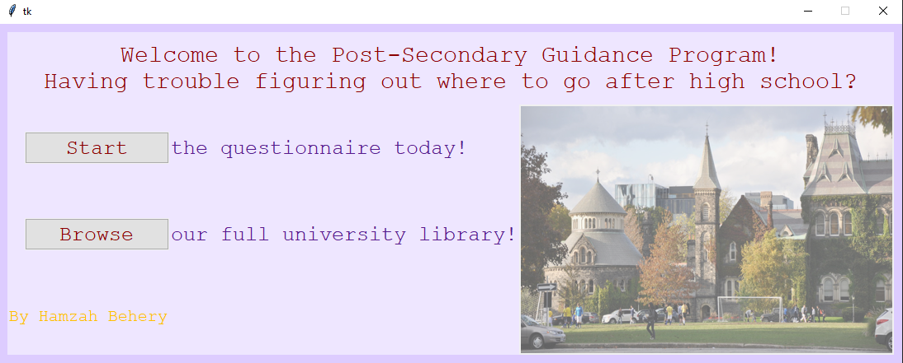
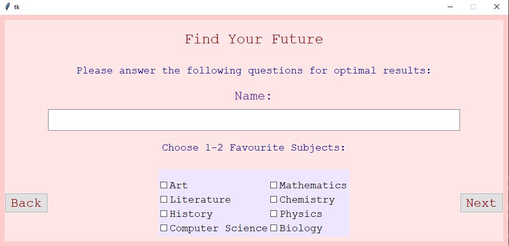
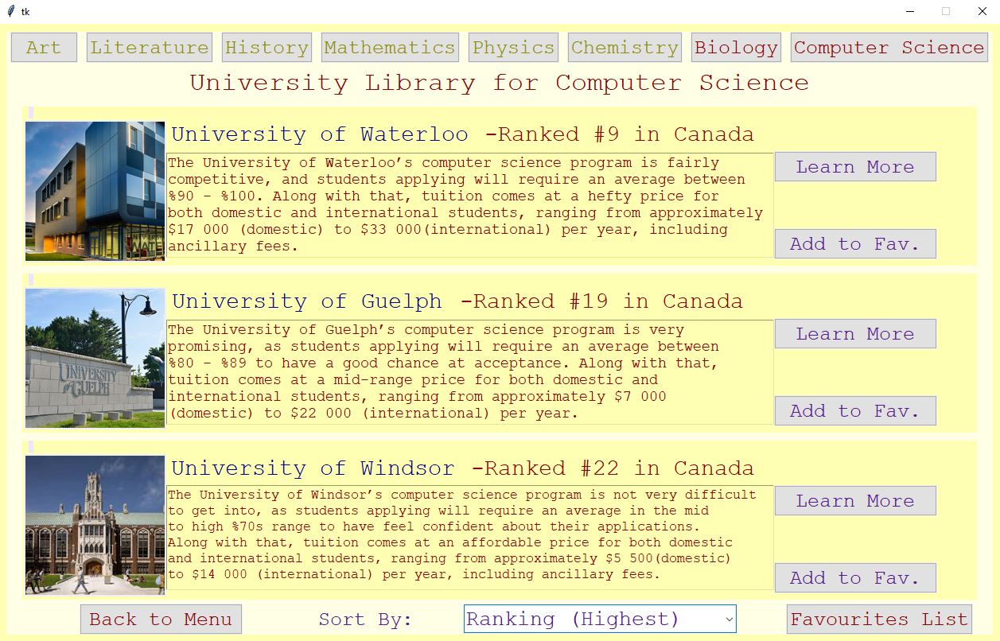

## PSGP: Post-Secondary Guidance Program

Coded in Python tkinter, this is a program that gives you a general outlook towards which Canadian unviverstiy and program may be the best for you! Recommendations are based on different factors such as:

- Favourite subjects in highschool
- Grades/Average range
- Budget for total expenses per year
- Canadian Citizenship/Residency

**If you don't want to fill out the questionnaire (none of your data is saved), you can simply browse through the catalog of different universities per subject area:**

> **_NOTE:_** The only programs/subjects for which universities were input are Biology and Computer Science.
> You can also add universities to your favourites list or sort them by ranking, tuition, and campus size.

## Future Plans:

- Deploy project
- Update university catalog
- Diversify subject areas
